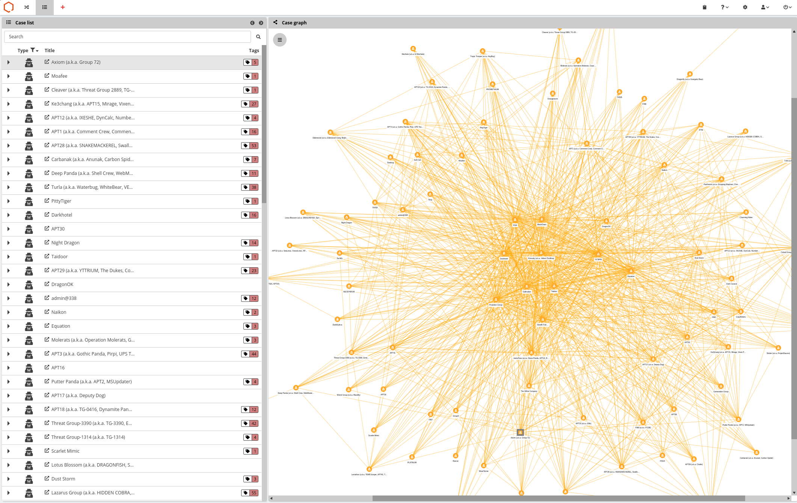
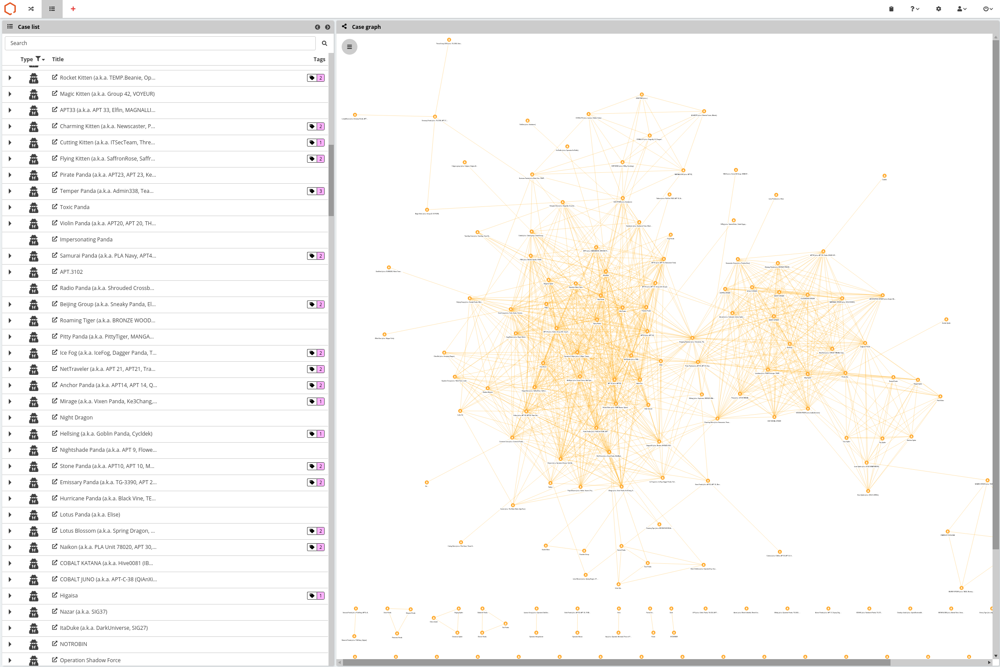

# About

This is a collection of Python3 scripts to make some particular tasks easier to handle with [QuoLab](https://quolab.com).
It also should help others to learn on using [pyquo](https://github.com/quolab/pyquo) to script tasks with [QuoLab](https://quolab.com).

## Prerequisites

The common denomitator for these scripts to run properly is to have QuoLab REST client package 'pyquo' installed.
The simplest way to get pyquo installed is through pip, for instance for python3 run:
```
pip3 install pyquo
```
You also can find the latest master directy on [QuoLab's github](https://github.com/quolab/pyquo)
Each script have individual requirements, we suggest you check the script imports or give a run to figure.

# ATTCKgroups.py

That script aims at importing [MITRE ATT\&CK groups](https://attack.mitre.org/groups/) as cases into QuoLab.

MITRE is [distributing and maintaining](https://www.mitre.org/capabilities/cybersecurity/overview/cybersecurity-blog/attck%E2%84%A2-content-available-in-stix%E2%84%A2-20-via) these intrusion sets, which thanks to [Cyb3rWard0d](https://github.com/Cyb3rWard0g) can directly be used in your python code through the [attackcti package](https://github.com/hunters-forge/ATTACK-Python-Client)

The script will basically create for each intrusion set a case with the following:
* The case name will be the one of the threat actor, including aliases in parenthesis
* The case will be tagged using the ATT\&CK techniques listed along with the intrusion set
* The case will be popupated with Malware facts listed as ATT\&CK softwares along with the intrusion set
* Each external reference will be used to create folders within the case, the reference URL will be added to the folder
* For external references leading to a PDF document, the document will be stored into the folder as well parsed for indicators, which would also be added to the folder

## Usage

The script should be ran directly from commandline using python3, host and creds parameters are mandatory.
The filter parameter can be used to specify some particular intrusion set, if not set all sets will be imported.

```
$ python3 ./ATTCKgroups.py --help
usage: ATTCKgroups.py [-h] --host HOST --creds CREDS [--filter FILTER]

QuoLab importer for MITRE ATT&CK groups intrusiton set

optional arguments:
  -h, --help       show this help message and exit
  --host HOST      https://qlab.quo
  --creds CREDS    username:password
  --filter FILTER  apt1,...
```

In practice on a clean fresh QuoLab node, importing existing 90+ intrusion is looking like that:


# MISP_TA_Galaxy.py

That script aims at importing [MISP threat-actor galaxy](https://github.com/MISP/misp-galaxy/blob/master/clusters/threat-actor.json) as cases into QuoLab.

The script will basicall create for each threat actor a case with the following:
* The case name will be the one of the threat actor, including aliases
* The case will be tagged with the `cfr-target-category` mapped to QuoLab Industry tags
* Each external reference will be used to create folders within the case, the reference URL will be added to the folder
* For external references leading to a PDF document, the document will be stored into the folder as well parsed for indicators, which would also be added to the folder

## Usage

The script should be ran directly from commandline using python3, host and creds parameters are mandatory.

```
$ python3 MISP_TA_Galaxy.py --help
usage: MISP_TA_Galaxy.py [-h] --host HOST --creds CREDS

QuoLab importer for the MISP threat-actor galaxy

optional arguments:
  -h, --help     show this help message and exit
  --host HOST    https://qlab.quo
  --creds CREDS  username:password
```

In practice on a clean fresh QuoLab node, importing the 324 threat actors (as of May 28th 2020) is looking like that:


# upload_dir.py and watch_dir.py

Both scripts aim at uploading files from a directory toward a particular existing QuoLab case (or folder in a case).
The script upload_dir.py just does that, watch_dir.py will watch a directory for newly created files and immediatly upload them to the target case.

## Usage

Both scripts should be ran directly from commandline using python3, host, creds, caseid and dir parameters are mandatory.

```
$ python3 upload_dir.py --help
usage: upload_dir.py [-h] --host HOST --creds CREDS --caseid CASEID --dir DIR

Upload content of a directory to a QuoLab case

optional arguments:
  -h, --help       show this help message and exit
  --host HOST      https://qlab.quo
  --creds CREDS    username:password
  --caseid CASEID  HPUeI5kDTTyNlWGZbbnQQA
  --dir DIR        target directory
```

```
$ python3 watch_dir.py --help
usage: watch_dir.py [-h] --host HOST --creds CREDS --caseid CASEID --dir DIR

Watch a directory and upload new files to a QuoLab case

optional arguments:
  -h, --help       show this help message and exit
  --host HOST      https://qlab.quo
  --creds CREDS    username:password
  --caseid CASEID  HPUeI5kDTTyNlWGZbbnQQA
  --dir DIR        target directory
```

# spiderfoot_profiler.py

That script aims at importing [Spiderfoot](https://www.spiderfoot.net/) JSON reports to QuoLab as profile case(s).

## Usage

```
$ python3 spiderfoot_profiler.py --help
usage: spiderfoot_profiler.py [-h] --host HOST --creds CREDS --input INPUT
                              [--caseid CASEID] [--casename CASENAME]

Imports Spiderfoot JSON output to QuoLab case

optional arguments:
  -h, --help           show this help message and exit
  --host HOST          https://qlab.quo
  --creds CREDS        username:password
  --input INPUT        spiderfoot JSON report
  --caseid CASEID      example HPUeI5kDTTyNlWGZbbnQQA
  --casename CASENAME  case name to be created
```

# timeline2elk.py

That script tap on all or a specific set of timelines to display events on console and optionally pushes them to an ELK instance for further analysis.

## Usage
```
$ python3 timeline2elk.py --help
usage: timeline2elk.py [-h] --host HOST --creds CREDS [--elk ELK]
                       [--timelines TIMELINES] [--debug]

Track QuoLab timeline events and dump them to ELK

optional arguments:
  -h, --help            show this help message and exit
  --host HOST           quolab host
  --creds CREDS         username:password
  --elk ELK             elk host
  --timelines TIMELINES
                        timeline ID, ...
  --debug
```
 
# Acknowledgments

* Hat tip to the [QuoLab](https://quolab.com) team for the hard work
* All the inspiration from the InfoSec community over the years
* The [MISP Project](https://www.misp-project.org/) folks and contributors
* The amazing work from the [ATT\&CK](https://attack.mitre.org) folks and contributors
